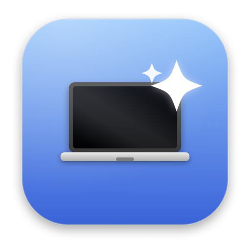
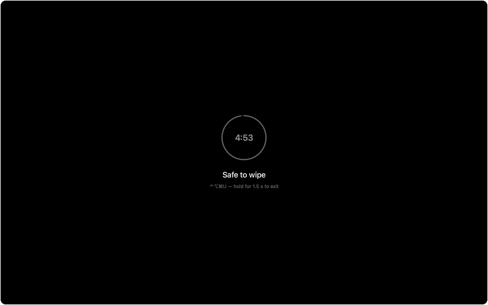
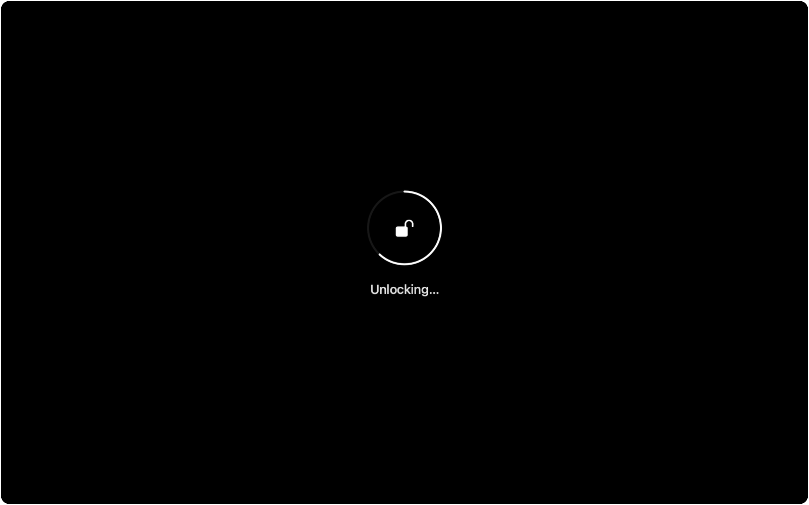

<div align="center">



# WashMyMac

**Чёрный экран и мёртвая клавиатура. Протрите MacBook, ничего в него не натыкав.**

[](https://github.com/AppsGanin/WashMyMac/releases/latest)
[](https://github.com/AppsGanin/WashMyMac/actions)
[](https://github.com/AppsGanin/WashMyMac/releases)
[](#требования)
[](LICENSE)

[English version](README.md)

</div>

---

Протирать MacBook мешают сразу две вещи. Светящийся экран прячет ровно те разводы, которые
вы оттираете, — трёте вслепую, а результат видите через час в тёмной комнате. И тряпка,
проехавшая по клавиатуре, печатает в то, что открыто: переименовывает файлы, дёргает
сочетания, иногда удаляет что-нибудь нужное.

Закрыть крышку не выход — под закрытой крышкой стекло не протрёшь. Заблокировать экран тоже:
клавиатура останется живой, просто теперь вы возите крошки по полю ввода пароля.

WashMyMac гасит все дисплеи до чёрного, отключает клавиатуру, трекпад и мышь и возвращает
Mac, когда вы удержите комбинацию, которую тряпке не набрать.



## Что умеет

- **Чистый чёрный на каждом дисплее.** Не заставка и не притушенный рабочий стол, а ровное
  чёрное поле, на котором видно каждый развод, отпечаток и пылинку.
- **Ввод умирает целиком.** Клавиатура, трекпад и мышь вместе с системными сочетаниями:
  ⌘Space, ⌘⇥, ⌘Q, громкость, яркость, жесты трекпада.
- **Выход, который не нажать тряпкой.** ⌃⌥⌘U с удержанием — и только пока не зажата ни одна
  лишняя клавиша.
- **Автовыход, всегда включён.** От одной минуты до тридцати. Пункта «никогда» намеренно
  нет: это единственная гарантированная дверь наружу.
- **Экран не задремлет.** Power-assertion плюс регулярный сигнал активности — иначе macOS,
  от которой мы спрятали весь ввод, решит, что за компьютером никого нет.
- **Маячок, чтобы видеть, что Mac жив.** Когда подсказка растворяется, внизу остаётся
  тусклая пульсирующая точка с комбинацией выхода: пустой чёрный экран выглядит ровно как
  выключенный.
- **Режим киоска.** Dock и меню-бар не выедут, даже если ткнуть тряпкой в край экрана.
- **Ничего не может залипнуть.** Оба слоя живут ровно столько, сколько живёт процесс: убейте
  приложение — блокировка снимется сама.
- **Английский и русский** по языку системы.
- **Чистый Swift и AppKit.** Без зависимостей, без демона, без телеметрии и без сети.
- **Универсальный бинарник**, Apple Silicon и Intel.

## Установка

Скачайте `.dmg` из [последнего релиза](https://github.com/AppsGanin/WashMyMac/releases/latest),
откройте его и перетащите `WashMyMac.app` на папку `Applications` в окне.

> [!NOTE]
> Приложение подписано ad-hoc, а не сертификатом Apple Developer, поэтому первый запуск
> macOS заблокирует. Начиная с macOS 15 правый клик → «Открыть» это больше не обходит:
> запустите приложение, дайте себя заблокировать, затем откройте **Системные настройки →
> Конфиденциальность и безопасность** и нажмите **Всё равно открыть**. Один раз.

> [!IMPORTANT]
> Перенесите приложение в `/Applications` *до* выдачи «Универсального доступа». macOS
> привязывает разрешение к пути и хешу кода, поэтому переезд после выдачи молча его
> обнуляет — ровно это и происходит, если один раз запустить приложение из `~/Downloads`.

Приложение живёт в меню-баре, в Dock его нет. При первом запуске режима чистки оно попросит
доступ в «Универсальный доступ» — что изменится, если отказать, написано
[ниже](#разрешение-универсальный-доступ).

## Как пользоваться

| Действие | Как |
| --- | --- |
| Включить режим чистки | **⌃⌥⌘W** или меню-бар → **Протереть Mac** |
| Выйти | **⌃⌥⌘U**, удерживать 1,5 с |
| Вернуть подсказку | **⌃⌥⌘** без U, придержать |
| Выйти, если ничего не помогает | дождаться автовыхода — по умолчанию пять минут |

Первые несколько секунд кольцо в центре отсчитывает время до автовыхода. Потом подсказка
растворяется, экран становится по-настоящему чёрным, и внизу остаётся только маячок.

## Комбинация выхода



Зажмите ⌃⌥⌘U — то же самое кольцо наливается за 1,5 секунды. Отпустили раньше, и оно падает
в ноль.

Комбинация засчитывается, только когда зажаты ровно три модификатора и клавиша U — **ни
одной лишней**. Тряпка всегда давит соседей, поэтому выполнить это условие она не может,
куда её ни вези. Задели Shift или вторую букву — отсчёт обнуляется.

Та же логика охраняет жест подсказки: ⌃⌥⌘ без ничего возвращает текст на экран, так что
комбинацию можно подсмотреть, не прерывая чистку.

## Как это устроено

Три слоя, потому что macOS раздаёт ввод на трёх разных глубинах:

| Слой | Что блокирует | Нужно разрешение |
| --- | --- | --- |
| `CGEventTap` на уровне сессии | Всё: клавиши, мышь, скролл, жесты, медиа-клавиши, системные сочетания | «Универсальный доступ» |
| Окно на `CGShieldingWindowLevel()` | Всё, что адресовано приложению; закрывает меню-бар, Dock и вырез камеры | Нет |
| `NSApplicationPresentationOptions` | ⌘⇥, ⌘⌥⎋, Dock, меню-бар, выключение через меню Apple | Нет |

Tap стоит в самом начале очереди событий, раньше WindowServer, поэтому системные горячие
клавиши он съедает до того, как их кто-то увидит. Побочный эффект: macOS вообще перестаёт
видеть активность пользователя — за это отвечает `DisplayKeeper`, который держит assertion
`NoDisplaySleep` и раз в 20 секунд объявляет пользователя активным, чтобы экран не потух
посреди протирки.

Каждым слоем владеет процесс. Упадёт приложение — умрёт tap, вернутся presentation options,
исчезнет окно. Блокировка не может пережить то, что её создало.

## Разрешение «Универсальный доступ»

Полная блокировка ввода требует одного разрешения:

**Системные настройки → Конфиденциальность и безопасность → Универсальный доступ →
WashMyMac**

Открыть нужный раздел приложение предложит само при первом запуске режима чистки.

Без разрешения WashMyMac всё равно работает: экран чернеет, окно-щит закрывает всё, обычные
нажатия ни к чему не приводят. Но системные сочетания обрабатывает WindowServer раньше любого
приложения, поэтому ⌘Space откроет Spotlight за чёрным экраном, а Ctrl+↑ вслепую забросит вас
в Mission Control. В этом режиме на экране висит оранжевое предупреждение.

> [!IMPORTANT]
> Приложение подписано ad-hoc, поэтому хеш кода меняется при каждой пересборке — а macOS
> привязывает разрешение именно к нему. После сборки новой версии удалите старую запись
> кнопкой **−** и выдайте доступ заново. Остатки чистит
> `tccutil reset Accessibility com.ganin.washmymac`.

## Чего приложение не может

Это ограничения macOS, а не недоделки:

- **Кнопка питания и Touch ID** усыпляют или блокируют Mac. Обрабатываются железом,
  перехватить нечем — заодно это ваш аварийный выход.
- **Долгое удержание кнопки питания** перезагружает принудительно, та же история.
- **Secure Input.** Если активное приложение включило защищённый ввод — открытое поле
  пароля, некоторые терминалы, — tap не получит нажатия клавиш. Закройте поле пароля.
- **Caps Lock** переключит светодиод; само нажатие проглатывается.

## Сборка из исходников

```bash
./build.sh --install          # → /Applications/WashMyMac.app
./build.sh                    # → .build/bundle/WashMyMac.app
./tools/make-dmg.sh           # → dist/WashMyMac-v<версия>.dmg
```

Нужен только Xcode или Command Line Tools. Универсальный бинарник, бандл, локализации и
иконка собираются одним скриптом — иконка рисуется кодом в
[`tools/make_icon.swift`](tools/make_icon.swift), так что бинарных ассетов в исходниках нет.
Недостающий перевод роняет сборку:
[`tools/check-localization.sh`](tools/check-localization.sh) сверяет ключи `L.t("…")` из
исходников с каждым `Localizable.strings`.

Посмотреть оформление, ничего не блокируя:

```bash
/Applications/WashMyMac.app/Contents/MacOS/WashMyMac --preview
```

Ключ `--unlocking` покажет кольцо разблокировки, `--beacon` — состояние после того, как
подсказка ушла, `--degraded` — предупреждение об отсутствии разрешения, а
`-AppleLanguages '(en)'` переключит язык.

Релизы выпускает [release-please](https://github.com/googleapis/release-please) по
[Conventional Commits](https://www.conventionalcommits.org): коммит `feat:` или `fix:` в
`main` — и открывается релизный PR с поднятой версией и changelog. Мержите его, и релиз
получает тег и собранный `.zip`.

## Требования

macOS 13 Ventura или новее. Apple Silicon и Intel. Язык интерфейса берётся из системного —
английский или русский.

## Лицензия

[MIT](LICENSE)
